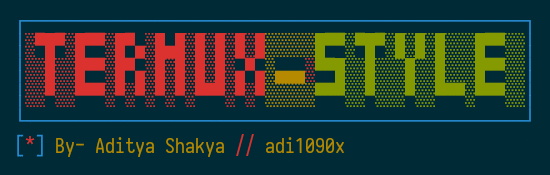
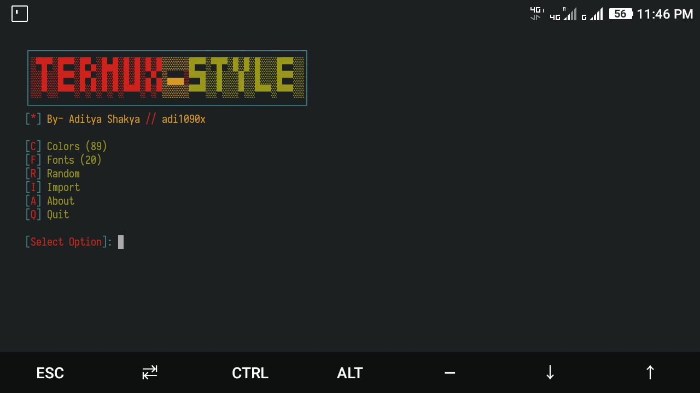
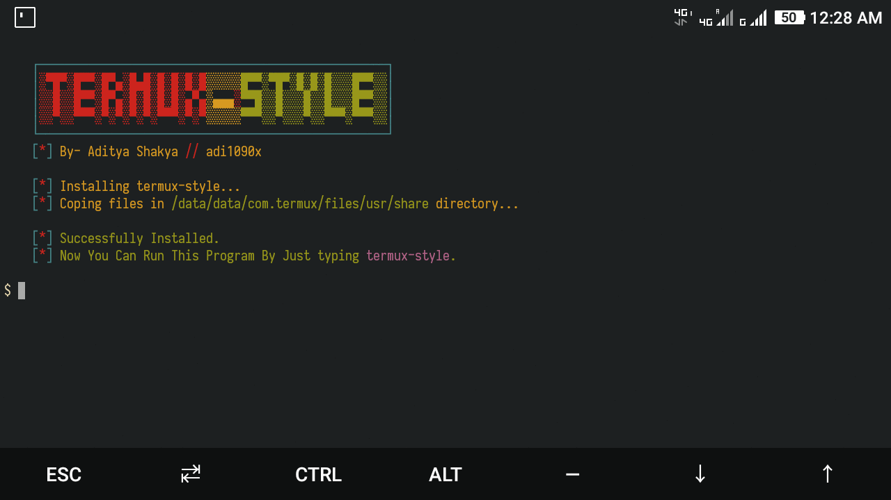

# Termux-Style
# Termux Style

<p align="left">
  
  
  
  
  
</p>

Simple script to change color-schemes and fonts for [Termux](https://termux.com) terminal emulator.

 <br />

> **`termux-style` provides color-schemes and powerline-ready fonts to customize the appearance of the Termux terminal.**

### How to install

Follow the steps below - 

```bash

apt install git -y


git clone https://github.com/Jangid-Shyam/Termux-Style.git


cd Termux-Style

# Run
./install

# And Follow the steps, it'll be installed on your system.
```

### Run

Run `Termux-Style` & select the right option -

```bash
$ Termux-Style

    ┌──────────────────────────────────────────────────┐
    │░▀█▀░█▀▀░█▀▄░█▄█░█░█░█░█░░░░░█▀▀░▀█▀░█░█░█░░░█▀▀░░│
    │░░█░░█▀▀░█▀▄░█░█░█░█░▄▀▄░▄▄▄░▀▀█░░█░░░█░░█░░░█▀▀░░│
    │░░▀░░▀▀▀░▀░▀░▀░▀░▀▀▀░▀░▀░░░░░▀▀▀░░▀░░░▀░░▀▀▀░▀▀▀░░│
    └──────────────────────────────────────────────────┘
    [*] By- Aditya Shakya // adi1090x

    [C] Colors (89)
    [F] Fonts (20)
    [R] Random
    [I] Import
    [A] About
    [Q] Quit
    
    [Select Option]: 
```

### Features

+ 90 popular color-schemes.
+ 20 powerline patched fonts.
+ Randomly change color-schemes.
+ Import color-schemes from *local file* or *file URL*.
+ Set colors and fonts in place.

### Use Import
```bash
    [Select Option]: 4

    [1] Local File (Enter path to file)
    [2] Internet File (Enter File URL)

    [Select Option]: 2

    [Enter Color-scheme URL]: https://raw.githubusercontent.com/adi1090x/termux-style/master/colors/gruvbox-dark.properties

    [*] Reloading Settings...
    [*] Applied Successfully.
```

+ To import *local file*, enter the full path (e.g. - `/data/data/com.termux/files/home/spiderman.properties`) of the color-scheme.
+ To import *web file*, enter the file url (e.g. - `https://raw.githubusercontent.com/adi1090x/termux-style/master/colors/gruvbox-dark.properties`) of the color-scheme.
<br />

### Previews

|Colorschemes|Fonts|
|--|--|
|||

|Import - URL|Import - Local|
|--|--|
|||

|Install|Uninstall|
|--|--|
|||

### FYI
- An `uninstall` script is also added, in case you want to remove this program.
- Again... If you can improve it, sure...
- Have fun!
